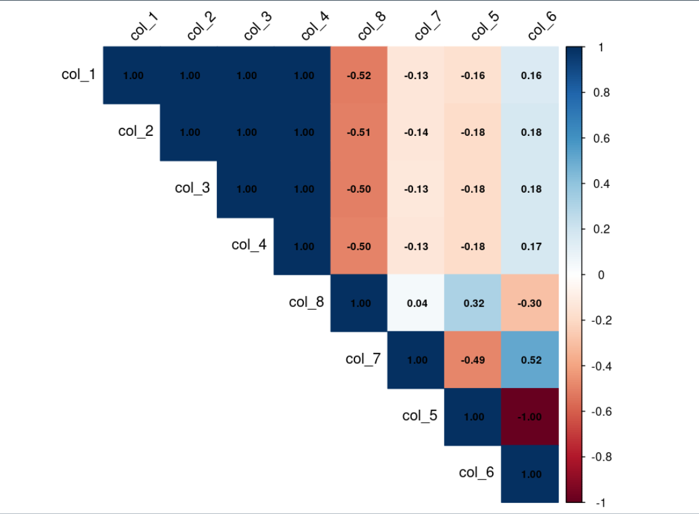

# Data Augmentation with K-means clustering algorithm.
This repository contains R code that augments an existing small tabular data that can then be used for a machine learning algorithm (i.e. neural network, linear regression, random forest etc). The algorithm works by exploiting the k-means clustering algorithm by applying it on the dissimilarity matrix of the data’s columns. Clustering similar columns into groups then randomly permuting rows in those clustered groups effectively “populates” the feature space of the dataset yet maintains the underlying correlations that make up critical relationships of the dataset. The k-means clustering algorithm works using the euclidean distance by default (hence why I apply it on a dissimilarity matrix).


# Explanation of the Files in this Repository: 

## Starting_Data_Correlation_Grid.png

This is the correlation matrix for the data. Columns {1,2, and 3} are highly correlated thus would be clustered together by the k-means algorithm while columns {5 and 6} would be in another cluster, while {7 and 8} would be in another (assuming 3 clusters was found to be optimal for the k-means algorithm for this dataset). 


## Augmented_Data_with_k-means_Clustering.R

This R code chunk takes in a dataset and forms the dissimilarity matrix (line #12). The columns are then grouped and rearranged in the dataframe so that columns with high levels of similarity are placed next to each other (line #22) and eventually grouped together into a list (line #59). A small section of rows from each group are selected and randomly permuted (lines 67 -76). And the column subsets are replaced back into the list. Finally the column subsets in the list are all recombined into a singular dataframe (line #81). 

```
# ----------------------------------------------------------------------- column clustering algorithm
dataframe_column_grouping <- function(input_df, group_num){
    
    cor_mat <- round(cor(input_df), 3) # correlation matrix
    
    # The distance matrix (aka dissimilarity matrix) will be used so that the grouping based in the 
    # euclidean distance (default for k-clustering in R) returns groups
    # with vectors that are correlated. 
    
    distances <- ifelse(cor(cor_mat) < 0 , abs(-1-cor(cor_mat)), abs(1-cor_mat))
    # Perform the k-means clustering algorithm. 
  
    k_means <- kmeans(t(distances), centers = group_num)
    
    column_clustered_df <- as.data.frame(t(k_means$cluster))
    
    col_groups <- sort((as.vector(unlist(column_clustered_df[1,]))))
    
    # reorder the column so that columns with high similarity are next to each other.
    col_permuted_df <- input_df[ ,order((as.vector(unlist(column_clustered_df[1,]))))]
    
    outputs <- list(col_permuted_df, col_groups) 

return(outputs)
}

dataframe_column_grouping_list <- dataframe_column_grouping(data,3) 
grouped_data <- dataframe_column_grouping_list[[1]]
col_group_vec <- dataframe_column_grouping_list[[2]]  

# --------------------------------------------------------------------- create colored correlation plot

colored_correlation_plot <- function(data){
  
  correlation_matrix <- cor(data) %>% round(3)
  
  corrplot(correlation_matrix, method = "color", 
           type = "upper",
           tl.col = "black",   # Text label color
           tl.srt = 45,        # Text label rotation
           addCoef.col = "black",  # Add correlation coefficients
           number.cex = 0.7)   # Size of the numbers
           #method = "pie",
           
}
colored_correlation_plot(data)

col_subset_list <- list()

for( colmn in c(1:length(unique(col_group_vec)))){ 
  focal_df <- data.frame( grouped_data[ ,(which(col_group_vec == colmn))] )
  colnames(focal_df) <- colnames(grouped_data)[which(col_group_vec == colmn)]
  col_subset_list[[ length(col_subset_list)+1 ]] <- focal_df
}
partition_size <- as.integer(nrow(data) / (length(col_subset_list)))

for(df in c(1:(length(col_subset_list)-1))){
  focal_df <- col_subset_list[[df]]
  focal_rows_start <- ((df*partition_size) - (partition_size - 1))
  focal_rows_start
  focal_rows_end <- (focal_rows_start + (partition_size - 1))
  
  if(df == length(col_subset_list) ){
    focal_rows_end <- nrow(data)
  }
  
  focal_rows_indices <- seq(from = focal_rows_start, to = focal_rows_end, by = 1)
  focal_df[focal_rows_indices, ] <- focal_df[sample(focal_rows_indices), ]
  col_subset_list[[df]] <- focal_df
}
synthetic_df <- do.call(cbind, col_subset_list)
```

## Augemented_Data_Correlation_Matrix.png

This is the correlation matrix for the augmented data. As we can see the correlations between the columns remain very similar to that of the initial dataset. 


